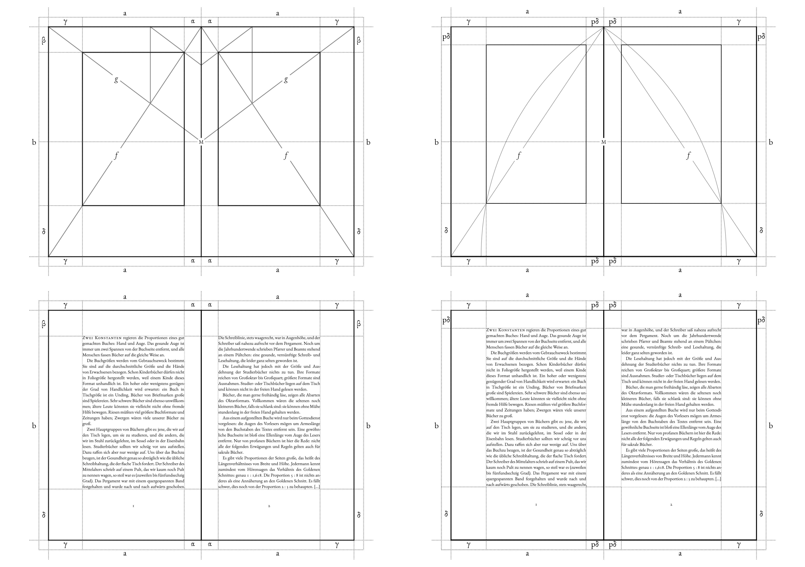

  <picture>
    <source media="(prefers-color-scheme: dark)" srcset="docs/tschich-logo-light.png">
    <source media="(prefers-color-scheme: light)" srcset="docs/tschich-logo-dark.png">
    
  </picture>

tschich is a simple tool for  achieving perfect proportions on the page — no matter the paper's dimensions.

